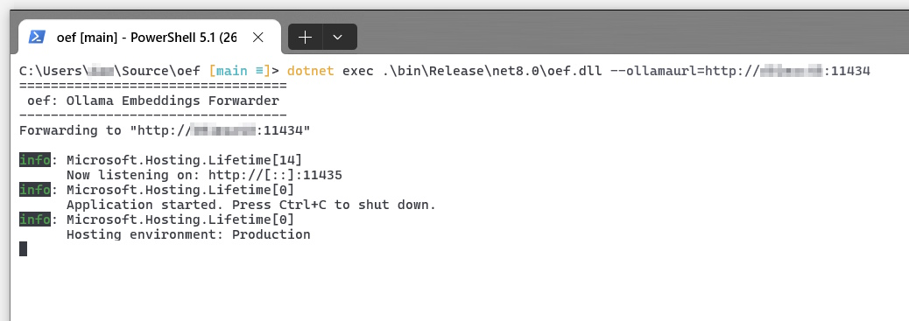

oef is a tiny dotnet web api that can receive GraphRAG embedding requests and forward them to an Ollama instance.

# Why?

This is necessary because GraphRAG expects an OpenAI compatible api that is very close to but not equal to the embedding api offered by Ollama.

Right now (July 2024) it is not possible to use Ollama embeddings within GraphRAG like this 

```yaml
# settings.yaml

llm:
  api_key: ollama
  type: openai_chat
  model: llama3.1:8b
  api_base: http://your-ollama-host:11434/v1                    # <-- /v1 has to be added for Ollama's OpenAI compatibility mode
  ...

embeddings:
  llm:
    api_key: ollama
    type: openai_embedding
    model: Losspost/stella_en_1.5b_v5:latest
    api_base: http://localhost:11435/v1                 # <-- Ollama is not supported here

```

Using Ollama for embeddings usually leads to this error:
> datashaper.workflow.workflow ERROR Error executing verb "cluster_graph" in create_base_entity_graph: Columns must be same length as key
 
```batch
datashaper.workflow.workflow INFO executing verb summarize_descriptions
graphrag.index.emit.parquet_table_emitter INFO emitting parquet table create_summarized_entities.parquet
graphrag.index.run INFO Running workflow: create_base_entity_graph...
graphrag.index.run INFO dependencies for create_base_entity_graph: ['create_summarized_entities']
graphrag.index.run INFO read table from storage: create_summarized_entities.parquet
datashaper.workflow.workflow INFO executing verb cluster_graph
graphrag.index.verbs.graph.clustering.cluster_graph WARNING Graph has no nodes
datashaper.workflow.workflow ERROR Error executing verb "cluster_graph" in create_base_entity_graph: Columns must be same length as key
Traceback (most recent call last):
  File "/usr/local/lib/python3.11/site-packages/datashaper/workflow/workflow.py", line 410, in _execute_verb
    result = node.verb.func(**verb_args)
             ^^^^^^^^^^^^^^^^^^^^^^^^^^^
  File "/usr/local/lib/python3.11/site-packages/graphrag/index/verbs/graph/clustering/cluster_graph.py", line 102, in cluster_graph
    output_df[[level_to, to]] = pd.DataFrame(
    ~~~~~~~~~^^^^^^^^^^^^^^^^
  File "/usr/local/lib/python3.11/site-packages/pandas/core/frame.py", line 4299, in __setitem__
    self._setitem_array(key, value)
  File "/usr/local/lib/python3.11/site-packages/pandas/core/frame.py", line 4341, in _setitem_array
    check_key_length(self.columns, key, value)
  File "/usr/local/lib/python3.11/site-packages/pandas/core/indexers/utils.py", line 390, in check_key_length
    raise ValueError("Columns must be same length as key")
ValueError: Columns must be same length as key
```

# How?

Clone and run oef with the following command

```bash
dotnet run --ollamaurl http://your-ollama-host:11434
```



|Setting|Command line argument|Environment variable|
|-|-|-|
|Port|--port|PORT|
|Ollama Url|--ollamaurl|OLLAMAURL|
